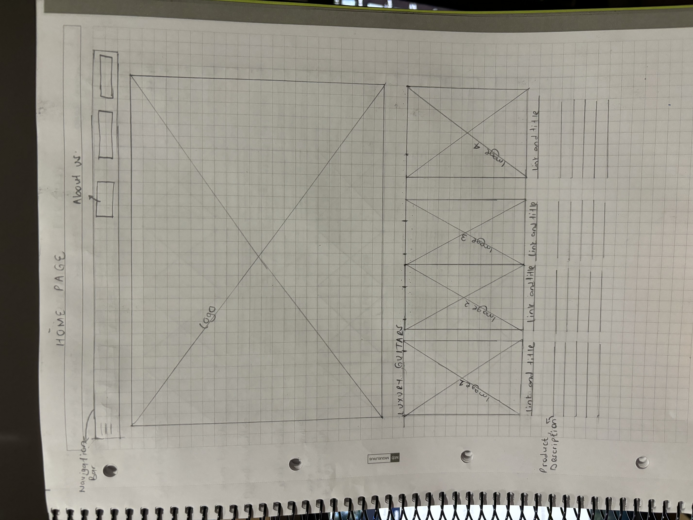
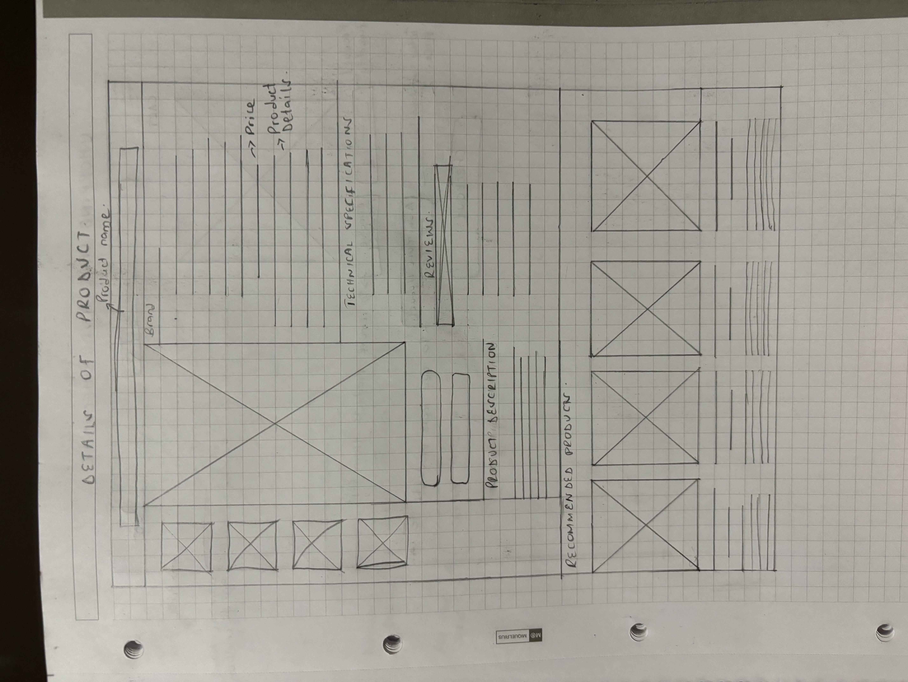
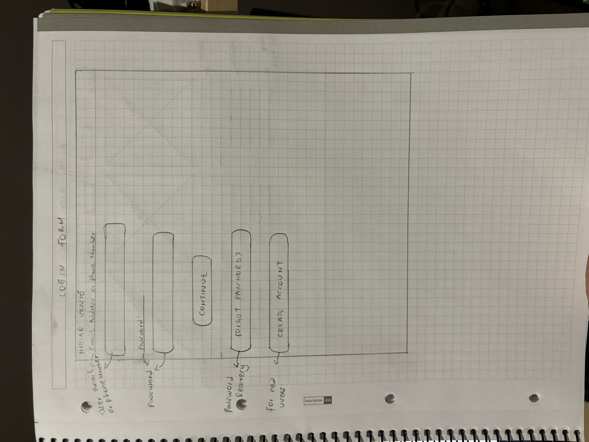

## HOME PAGE

The home page is designed for a straightforward user experience, ensuring that visitors can quickly access important content and product information.
This page provides an overview of the store, it contains: 
Store Presentation: It provides a brief introduction to the store and highlights our luxury guitar offerings.It also includes the company's logo.
Featured section: This section includes images of luxury guitars and short descriptions of selected products, showcasing key items to capture user interest.
Link to Products Section: A direct link is available, allowing users to navigate easily to the complete products section for more information and browsing options.

## PRODUCT CATALOG

This page serves as a wireframe layout for the Product catalog. It presents a structured list of available guitars which include:
Images- There's a placeholder images for each guitar available. This is designed to give the user a visual representation of the products.
Description- Contains a brief text section next to every guitar, this is to summarize the key features and and speficications about the item.
Prices- This is an area to display the prices of each product, ensuring the user can easily see the cost.
Extra Product option- Contains any additional options related to the guitars, such as the colors and customization features.

## DETAILS OF PRODUCTS

This page provides a  view of each products, including images, detailed descriptions, and pricing information. It also features customer reviews to help users assess the product's quality and performance. A section for recommended products is included, suggesting related items that may interest the customer to enhance their shopping experience.

## SHOPPING CART AND CHECKOUT

This page displays the products selected by the client which includes a brief description of each item and its price. Users have the option to easily add or remove products from their cart, allowing for flexible shopping.A checkout option is also available, guiding users through the purchasing process to complete their order.

## LOGIN FORM

This section is displayed after the user checks out their cart. It consists of a login form that facilitates account access through either an email address or phone number. The form includes:
Login Fields: Input fields for users to enter their credentials.
Password Recovery: A link that enables users to initiate the password recovery process if they have forgotten their login information.
Create Account Option: A  button that directs users to a registration page, allowing new customers to create an account easily.

## BLOGS AND NEWS

This section is dedicated to providing informative content related to guitars, including maintenance tips, industry news, and general articles of interest. It is structured to present:
Article Listings: A layout featuring a list of articles with titles, summaries, and publication dates for easy browsing.
Links or buttons that allow users to read full articles and explore additional related content.
